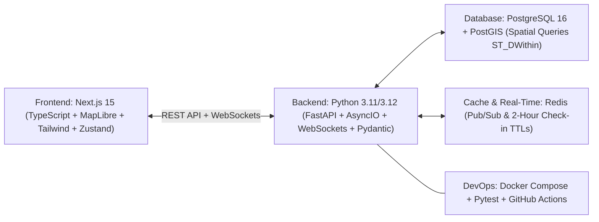

# CityPulse ⚡ Live Café, Study Spot & Co-Working Vibe Radar

CityPulse is a real-time geospatial radar web application designed for remote workers, freelancers, developers, and students to discover optimal cafés, libraries, and co-working spots in urban centers (starting with Oslo). It solves the problem of arriving at study spots only to find zero seating, loud environments, missing power outlets, or poor WiFi.

---

## 🌟 Key Features

- 📍 **Interactive Geospatial Radar Map**: Built with **MapLibre GL / Mapbox GL**, featuring animated pulsing radar pins colored by real-time vibe status (🟢 Optimal, 🟡 Moderate, 🔴 Packed).
- ⏱️ **Exponential Vibe Decay Engine**: Real-time vibe calculation decaying smoothly with a 60-minute half-life over 2 hours ($W(t) = e^{-\lambda \Delta t}$), ensuring recommendations are always fresh.
- ⚡ **30-Second Quick Check-In**: One-tap community updates for seat crowding, noise level, and power outlet availability.
- 🚀 **5-Second WiFi Speed Tester**: In-browser latency and download speed measurement automatically logging verified speeds to venue records.
- 📡 **Real-Time WebSockets & Redis Pub/Sub**: Zero-refresh instant updates streamed to all connected clients whenever a check-in is submitted.
- 🎯 **Work & Study Filters**: Filter by Outlets, Silent Zones, WiFi > 50 Mbps, Open Late, Outdoor Seating, Dog Friendly, and Place Type.
- 📚 **Curated Collections & Bookmarks**: Save favorite spots into lists (*"Best Coffee in Grünerløkka"*, *"Weekend Study Sanctuaries"*).

---

## 🏗️ Architecture & Technology Stack



| Layer | Technology |
| :--- | :--- |
| **Backend** | Python 3.11/3.12, FastAPI, AsyncIO, WebSockets, SQLAlchemy, GeoAlchemy2, Pydantic v2 |
| **Geospatial & Database** | PostgreSQL 16 + PostGIS extension (`ST_DWithin`, `ST_Distance`, `GIST` indexes) with standalone in-memory fallback |
| **Real-Time & Broker** | Redis Pub/Sub + WebSocket async event broadcaster |
| **Frontend Map** | Next.js 15 (App Router, React 19, TypeScript), MapLibre GL, Tailwind CSS, Lucide Icons, Zustand |
| **DevOps & Testing** | Docker Compose, Pytest, GitHub Actions CI/CD |

---

## 🚀 Quickstart Guide

### Option 1: Run with Docker Compose (Recommended)

```bash
docker compose up --build
```
- **Frontend Map**: [http://localhost:3000](http://localhost:3000)
- **FastAPI Backend & Swagger Docs**: [http://localhost:8000/docs](http://localhost:8000/docs)
- **PostGIS Database**: `localhost:5432`
- **Redis Cache**: `localhost:6379`

---

### Option 2: Run Locally (Standalone Mode)

#### 1. Backend Setup:
```bash
cd backend
python -m venv venv
# On Windows:
.\venv\Scripts\activate
# On macOS/Linux:
source venv/bin/activate

pip install -r requirements.txt
uvicorn app.main:app --reload --port 8000
```

#### 2. Frontend Setup:
```bash
cd frontend
npm install
npm run dev
```
Open [http://localhost:3000](http://localhost:3000) in your browser.

---

## 🧪 Running Automated Tests

```bash
# Backend Pytest Suite
cd backend
pytest tests/ -v
```

---

## 📡 API Endpoints Overview

- `GET /api/v1/venues/nearby`: Spatial search with radius & filters (`lat`, `lon`, `radius_meters`, `has_wifi`, `has_outlets`, `silent_zone`, `min_download_mbps`, `place_type`).
- `GET /api/v1/venues/{id}`: Venue details including live vibe status, decay factor, and recent check-ins.
- `POST /api/v1/venues/{id}/checkin`: Submit a 30-second live check-in (seats, noise, outlets).
- `GET /api/v1/speedtest/payload`: Calibrated binary chunks for in-browser download speed testing.
- `POST /api/v1/venues/{id}/speedtest`: Log verified WiFi speed and latency ping.
- `GET /api/v1/collections`: Curated collections and spot lists.
- `WS /api/v1/ws/live`: Real-time WebSocket connection for live vibe broadcasts.
