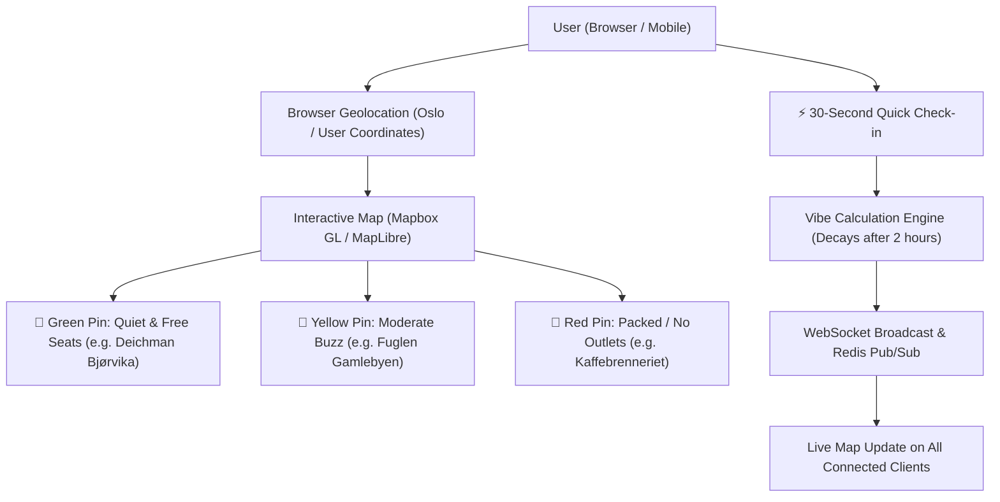
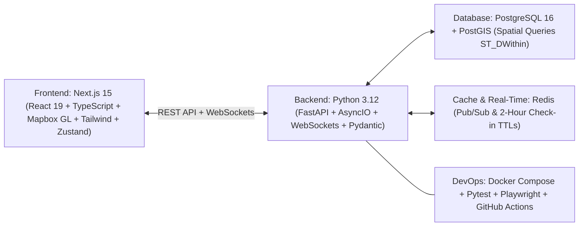
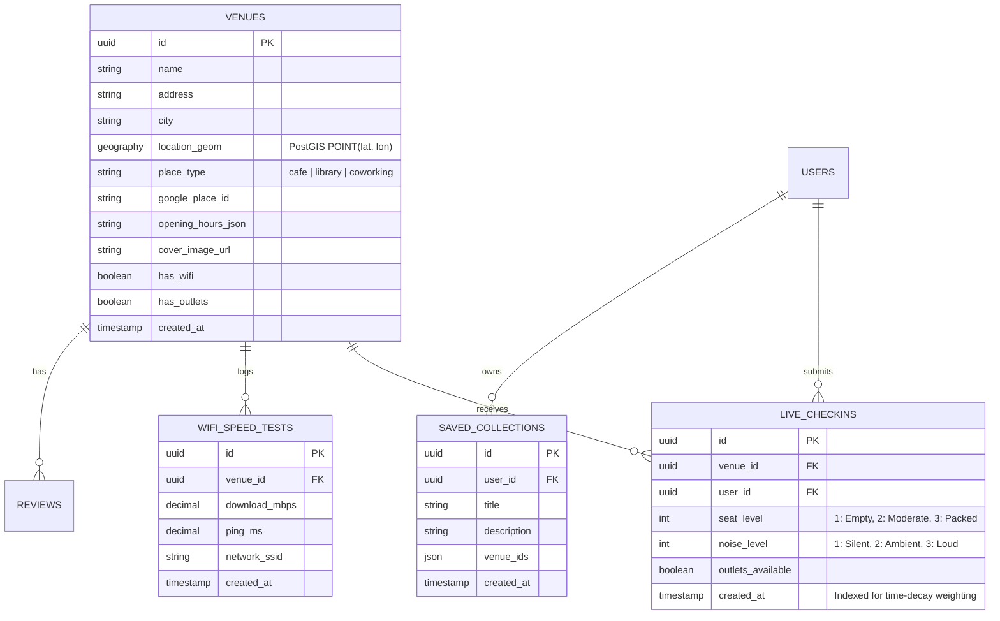

# CityPulse — Project Architecture & Implementation Plan

**Project Name:** CityPulse (Live Café, Study Spot & Co-Working Vibe Radar)  
**Target Market/Scope:** Urban centers (e.g., Oslo, Bergen, Stockholm, remote-friendly cities)  
**Core Problem Solved:** Remote workers, developers, freelancers, and students waste time traveling to cafés, libraries, and co-working spaces only to find zero available seating, noisy environments, lack of power outlets, or unreliable WiFi.  
**Primary Career Skill Gains:** **Python 3.12 (FastAPI + AsyncIO + WebSockets)**, **PostgreSQL 16 + PostGIS (Spatial Indexing & GPS Queries)**, **Redis (In-Memory Live Counts & Pub/Sub)**, **Interactive Map UI (Mapbox GL / MapLibre)**, **Automated Testing (Pytest + Playwright)**, and **Docker CI/CD**.

---

## 1. Core Feature Specification

### Key Features:
1. **Interactive Geospatial Map & Radar:**
   * Custom dark/light vector map showing coffee shops, public libraries, and hotel lobbies.
   * Color-coded pulsing pins indicating real-time vibe:
     - 🟢 **Optimal:** High seat availability, quiet/focused noise level, power outlets available.
     - 🟡 **Moderate:** Half full, ambient background music, some outlets available.
     - 🔴 **Packed:** No seats available, loud environment, no outlets.
2. **Filters That Actually Matter for Work & Study:**
   * *Outlets Available*, *Silent/Quiet Zone*, *WiFi > 50 Mbps*, *Open Late*, *Outdoor Seating*, *Dog Friendly*.
3. **The 30-Second Live Check-In (Community Sourced):**
   * One-click voting modal:
     - **Seats:** `[Empty (1)]` | `[Moderate (2)]` | `[Packed (3)]`
     - **Noise:** `[Whisper/Silent]` | `[Gentle Buzz]` | `[Loud/Music]`
     - **Outlets:** `[Plenty]` | `[Few]` | `[None]`
   * **Smart Ephemeral Decay:** Check-ins have an exponential decay algorithm (weight fades over 2 hours so data is always fresh).
4. **Built-In 5-Second WiFi Speed Tester:**
   * In-browser latency and download speed measurement to verify actual venue WiFi performance.
5. **Curated Collections & Bookmarks:**
   * Users can save spots into custom lists (*"Best Coffee in Grünerløkka"*, *"Weekend Study Sanctuaries"*).

---

## 2. Technology Stack Breakdown

---

## 3. Database Schema (PostgreSQL + PostGIS)

